# CY-J2EE
Sans Spring Boot

# Description

Notre projet est une application JEE qui permet à une entreprise de gérer ses ressources humaines, ses départements et ses projets.

Dans cette application, l'administrateur et les responsables ressources humaines peuvent voir la liste des employés, des départements et des projets de l'entreprise et en ajouter, les modifier et les supprimer.

Mais ils peuvent aussi générer des fiches de paie pour les employés et voir les statistiques dans les départements et les projets sour forme de tableaux et de graphiques.

## Installation :
### IntelliJ
1) Télécharger localement les fichiers du projet
2) Ouvrir le projet avec IntelliJ
3) Configurer le lancement du projet :
    1) Cliquer sur "Current File" en haut de la fenêtre IntelliJ
    2) Puis "Edit Configurations..."
    3) "Add new"
    4) "TomCat Server > Local"
    5) Dans l'onglet "Server", mettre l'URL à `http://localhost:####`/CY-J2EE/index.jsp
    6) Dans l'onglet "Deployment" :
        1) Ajoutez un nouvel artifact
        2) En bas de la page, Application context = /CY-J2EE

### Base de Données
1) Lancer Wampserver
2) Lancer MySQL WorkBench
3) Ouvrir un nouvel onglet sql
4) Copier et exécuter le contenu de [conception/JeeDb.sql]

# Compilation et exécution

Lorsque nous compilons et exécutons le programme, nous arrivons sur cette page :

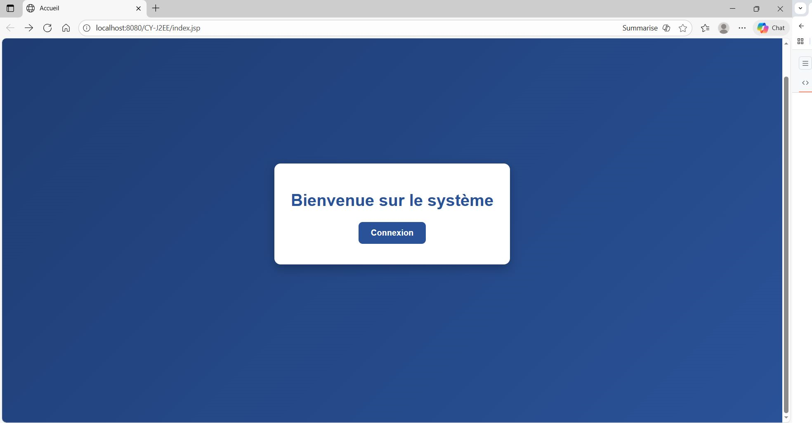

Puis on arrive sur la page de connexion :

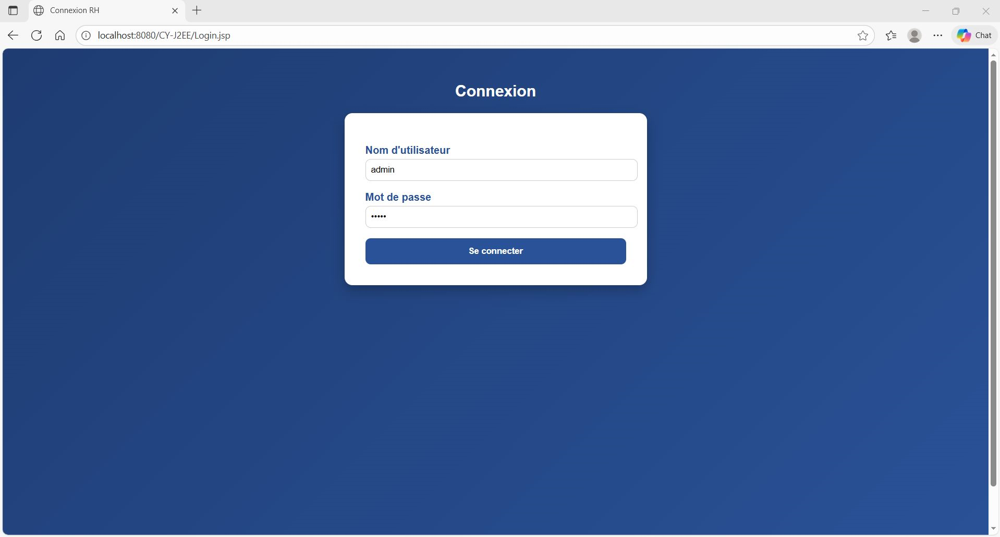

Si un administrateur ou Responsble ressources humaines se connecte, il arrive sur le tableau de bord : 

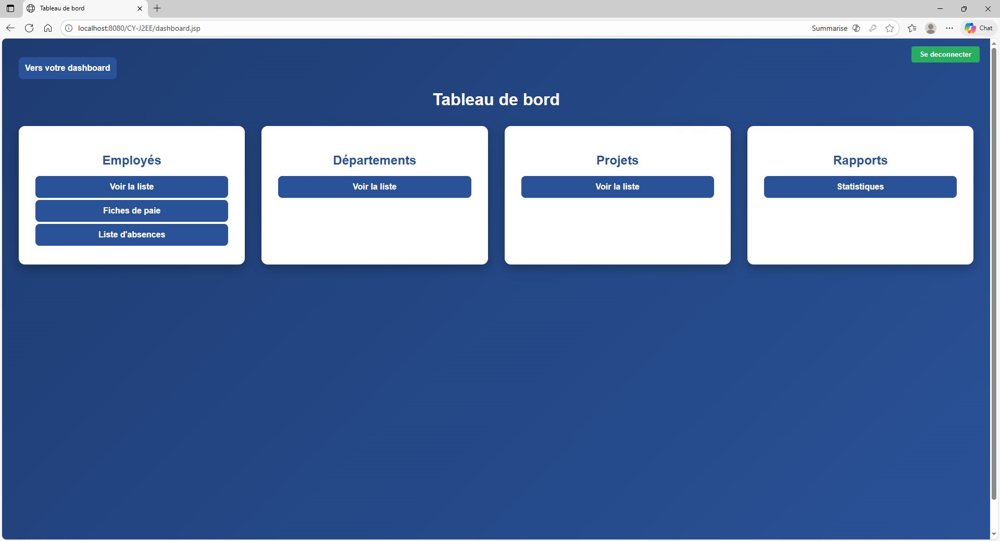

Depuis ce tableau de bord, il peut voir la liste des employés, avec ou sans filtre : 

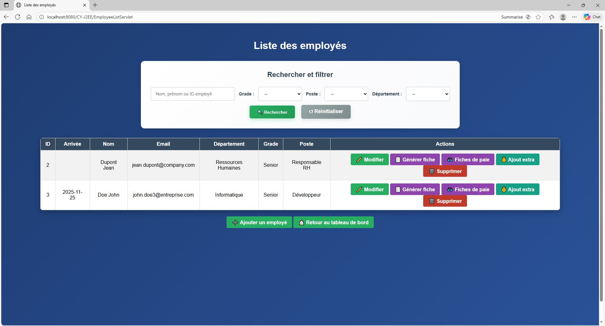

Il peut voir la liste des fiches de paie, avec ou sans filtre, et les consulter :

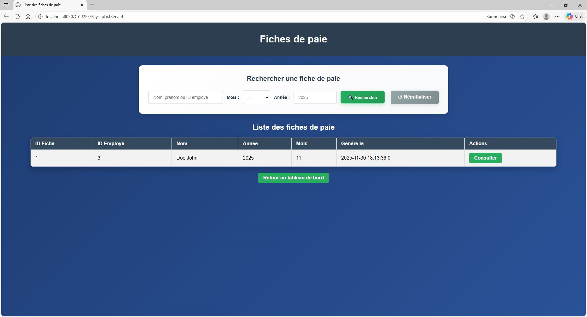
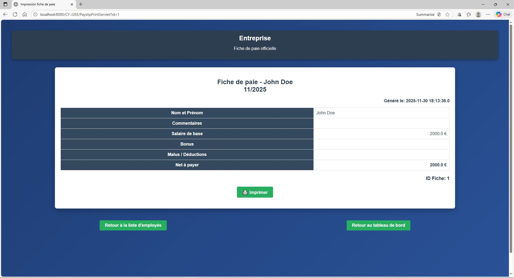

Il a accès à la liste des absences de chaque employé : 

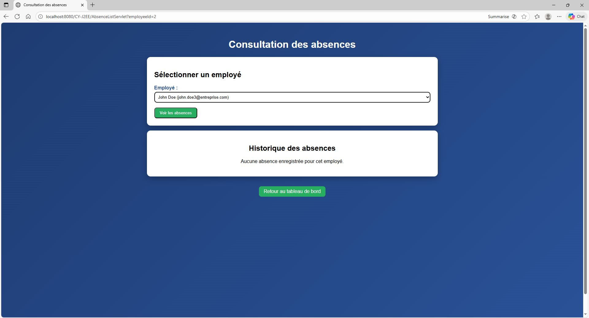

Il voit la liste des départements et les membres de chacun : 

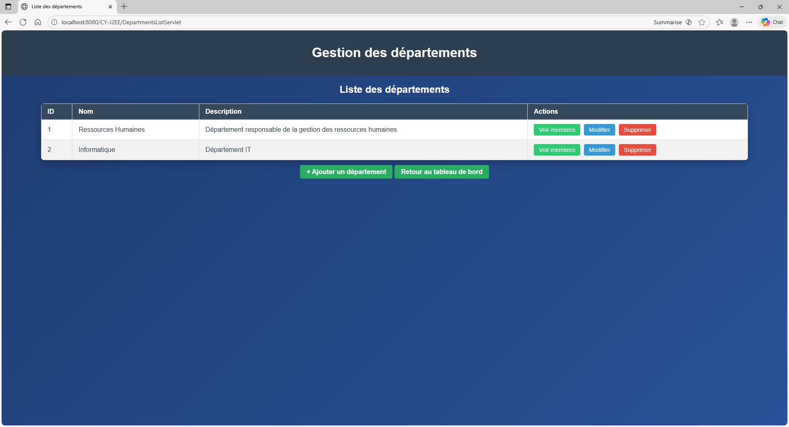
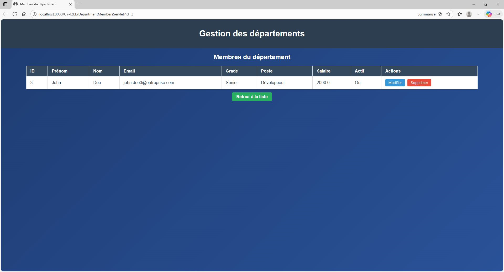

Il voit la liste des projets et les membres de chacun : 

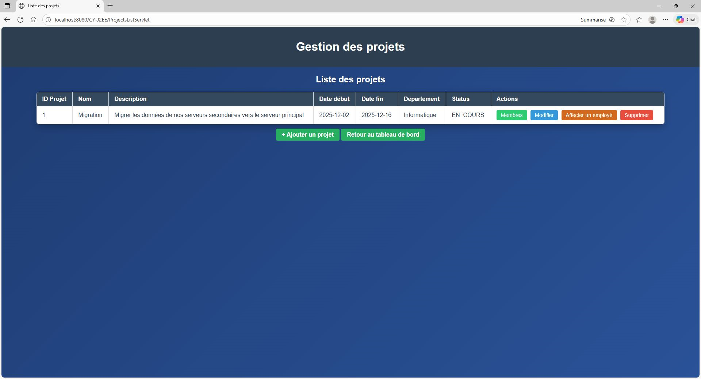
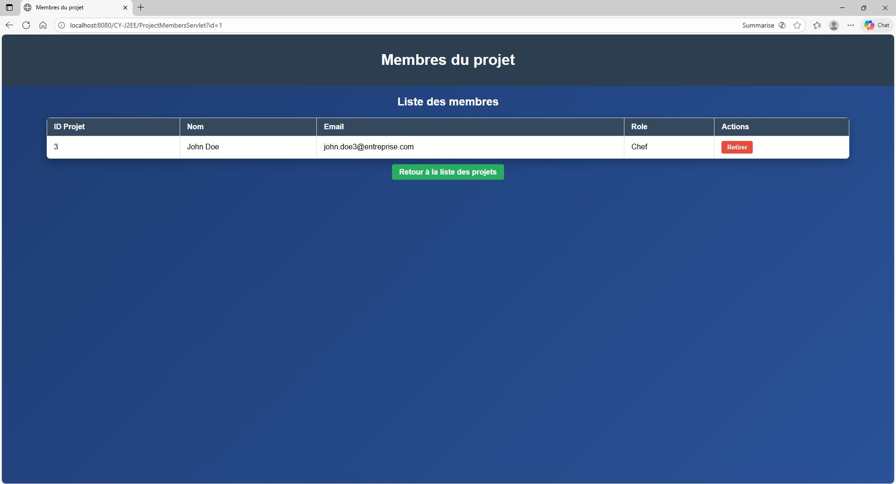

Il voit les statistiques des employés : 

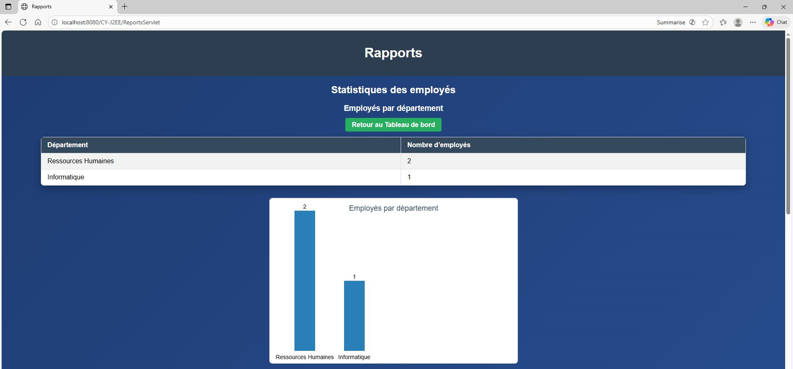
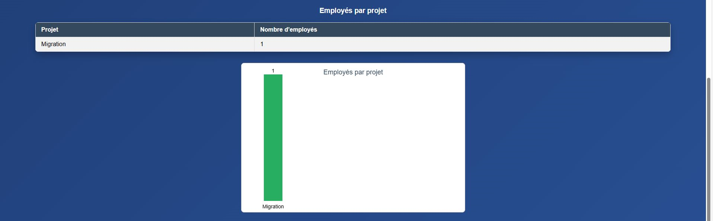
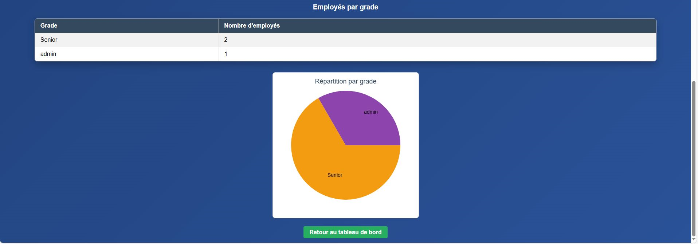

Mais il peut aussi accéder à son tableau de bord en cliquant sur "vers votre tableau de bord" :

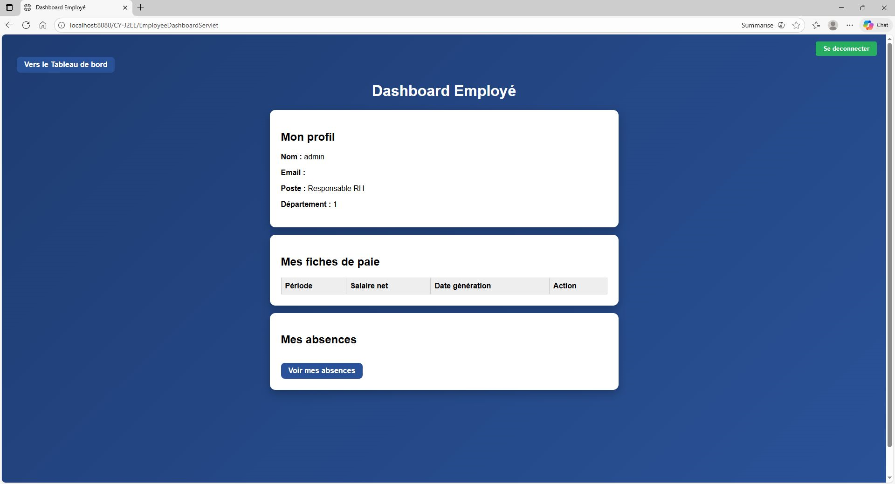

Maintenant si un employé se connecte pour la première fois, il devra changer son mot de passe :

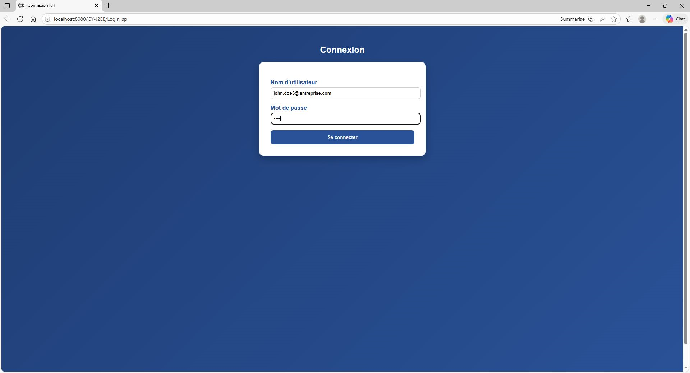
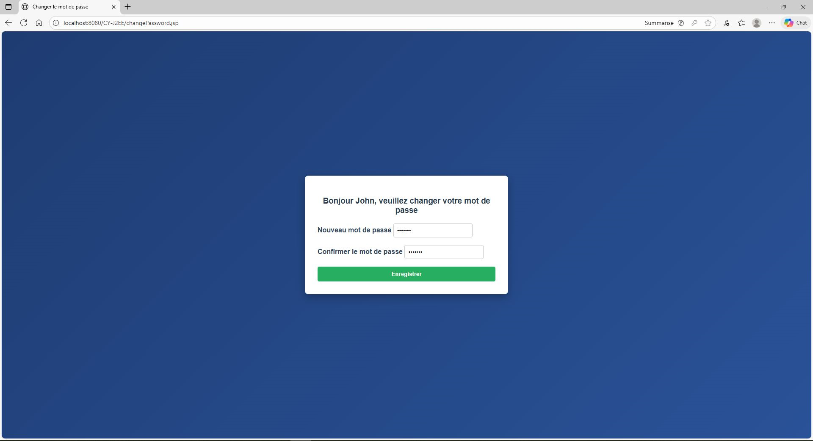

Et il sera redirigé vers son tableau de bord :

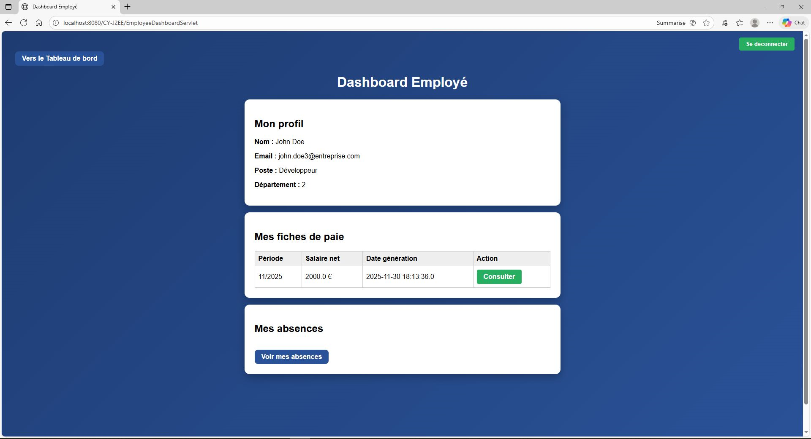

# Auteurs

- Esteban ABEHZELE
- Heeshaam FOWDAR
- Emiline LAM
- Mattéo MANRESA
- Younes NEHAD

# Informations

Professeur : Mohamed HADDACHE

Classe : GSI-1 (CY-Tech, Cergy)

Date finale de rendu : Dimanche 30 novembre 2025 avant 22h00
